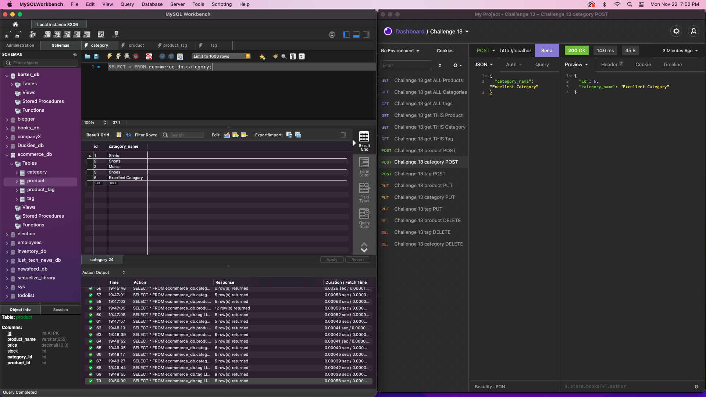
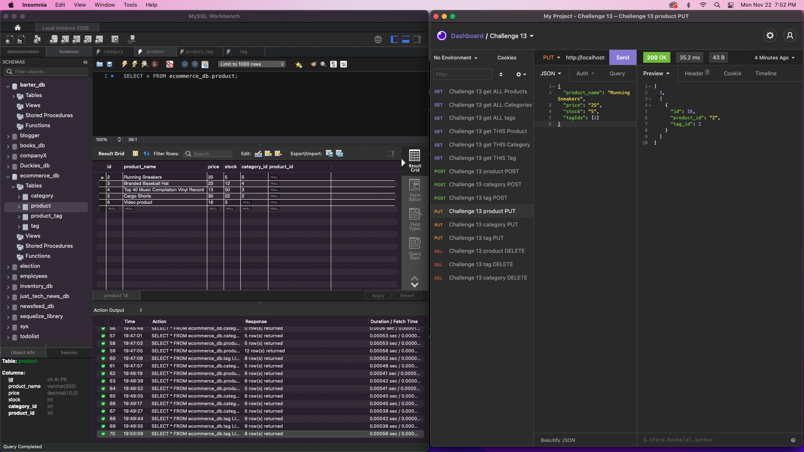

# Products database 

## Links

[Video Walkthrough](https://watch.screencastify.com/v/TEiLfX9AFozhKDb4ec7G)

[Github Repository](https://github.com/DuckArroyo/productsdb)

## Description

This is a backend project where I had to build models and routes for an e-commerce site.
The routes and models work correctly.

## Required installations for code duplication

- npm i
- node_modules/
- .gitignore
- .env - done
- dotenv package - https://www.npmjs.com/package/dotenv
- mysql2
- Mysql2 - https://www.npmjs.com/package/mysql2
- sequelize
- Sequelize - https://www.npmjs.com/package/sequelize

## The commandments

"scripts": {
"watch": "nodemon server.js",
"test": "echo \"Error: no test specified\" && exit 1",
"start": "node server.js",
"seed": "node seeds/index.js"
},

# Contributions by:

DeveloperDuckArroyo

[Email](mailto:DeveloperDuckArroyo@gmail.com)

[Portfolio](https://github.com/DuckArroyo/portfolio)

[React Portfolio](http://DuckArroyo.github.io/reactPortfolio)

[GitHub](https://github.com/DuckArroyo)

[Twitter @DevDuckArroyo](https://twitter.com/DevDuckArroyo)

[LinkedIn](https://www.linkedin.com/in/duckarroyo)

[CodePen](https://codepen.io/DeveloperDuckArroyo)

# Screnshots

## Developer Notes

- initiate server
  npm run watch or node server

- Models
  DONE

- seed db
  npm run seed

- review indexes
  DONE
- review routes
  Products - DONE
  Tags - DONE
  Category - DONE
- Test routes with insomnia
  -Create - DONE
  -Update - DONE
  -Delete - DONE

#### To do next

Create the code for the models

- Category
- Product
- ProductTag
- Tag
- relationships in index

DB model in it's own .md - DB_Model.md
